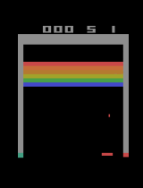
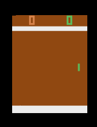
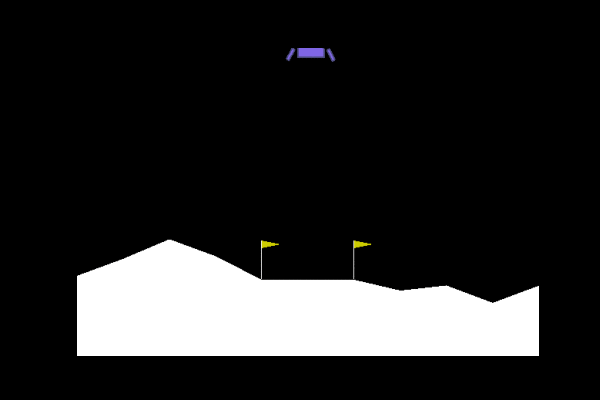
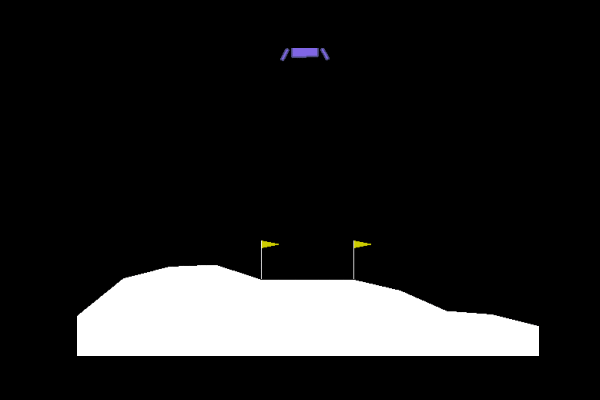

# MuZero
A PyTorch implementation of MuZero from [Mastering Atari, Go, Chess and Shogi by Planning with a Learned Model](https://arxiv.org/pdf/1911.08265.pdf).

* [x] Is distributed through [Ray](https://github.com/ray-project/ray)
* [x] Handles one/two-player games in style of [OpenAI Gym](https://github.com/openai/gym)
* [x] Live training results are logged with [Tensorboard](https://github.com/tensorflow/tensorboard)
* [x] Evaluate and visualize agent performance at any time.

## Trained Examples

### Breakout-ramNoFrameskip-v4

Random            |  Trained
:-------------------------:|:-------------------------:
 | 

[Tensorboard training results](https://github.com/JimOhman/model-based-rl/blob/master/data/Breakout/tensorboard.png)

### Pong-ramNoFrameskip-v4

Random            |  Trained
:-------------------------:|:-------------------------:
  |  

[Tensorboard training results](https://github.com/JimOhman/model-based-rl/blob/master/data/Pong/tensorboard.png)

### LunarLander-v2

Random            |  Trained
:-------------------------:|:-------------------------:
  |  

[Tensorboard training results](https://github.com/JimOhman/model-based-rl/blob/master/data/LunarLander/tensorboard.png)

### Tic-Tac-Toe

[Tensorboard training results](https://github.com/JimOhman/model-based-rl/blob/master/data/TicTacToe/tensorboard.png)

---
## Installation:
```bash
git clone https://github.com/JimOhman/model-based-rl.git
cd model-based-rl
pip install -r requirements.txt
```

## Reproduce examples:

* LunarLander-v2: ```python train.py --environment LunarLander-v2 --architecture FCNetwork --num_actors 7 
--fixed_temperatures 1.0 0.8 0.7 0.5 0.3 0.2 0.1 --td_steps 1000 --max_history_length 1000 --group_tag my_group_tag --run_tag my_run_tag```

* Pong-ramNoFrameskip-v4: ```python train.py --environment Pong-ramNoFrameskip-v4 --architecture FCNetwork --num_actors 7 
--fixed_temperatures 1.0 0.8 0.7 0.5 0.3 0.2 0.1 --td_steps 10 --obs_range 0 255 --norm_obs --sticky_actions 4 --noop_reset --episode_life  --group_tag my_group_tag --run_tag my_run_tag```

* Breakout-ramNoFrameskip-v4: ```python train.py --environment Breakout-ramNoFrameskip-v4 --architecture FCNetwork --num_actors 7 
--fixed_temperatures 1.0 0.8 0.7 0.5 0.3 0.2 0.1 --td_steps 10 --window_size 200000 --batch_size 512 --obs_range 0 255 --norm_obs --sticky_actions 4 --noop_reset --episode_life --fire_reset --clip_rewards --group_tag my_group_tag --run_tag my_run_tag```

* Tic-Tac-Toe: ```python train.py --environment tictactoe --two_players --architecture FCNetwork --num_actors 7 --fixed_temperatures 1.0 0.8 0.7 0.5 0.3 0.2 0.1 --td_steps 10 --discount 1 --known_bounds -1 1 --stored_before_train 20000 --group_tag my_group_tag --run_tag my_run_tag```

See live training results with tensorboard:
```bash
tensorboard --logdir model-based-rl/runs/(environment)/(group_tag)/(run_tag)
```

Evaluate saved networks:
```bash
python evaluate.py --saves_dir model-based-rl/runs/(environment)/(group_tag)/(run_tag)/saves/ --nets (eg. 1000, 2000) --render --plot_summary --include_policy
```

## Description of arguments:

|Network arguments| Description|
|:-------------|:-------------|
| `--architecture {FCNetwork, MuZeroNetwork, TinyNetwork, HopfieldNetwork, AttentionNetwork}` |Name of an implemented network architecture|
| `--value_support` |Min and max of the value support (default: -15 15)|
| `--reward_support` |Min and max of the reward support (default: -15 15)|
| `--no_support` |Turns off support|
| `--seed` |Sets the seed for the training run (default: randomly sampled from [0, 10000]|

|Environment arguments| Description|
|:-------------|:-------------|
| `--clip_rewards` |Clip rewards to [-1, 1]|
| `--stack_obs` |Stack given amount of consecutive observations to a new observation (default: 1)|
| `--obs_range` |Specify the (min, max) range for the dimensions of the observation (default: None)|
| `--norm_obs` |Normalize observations based on the given --obs_range|
| `--sticky_actions` |Apply same action a given amount of times (default: 1)|
| `--episode_life` |Prevent value bootstrapping after a loss of a life in Atari games|
| `--fire_reset` |Apply the FIRE action after a reset call in Atari games|
| `--noop_reset` |Apply the NOOP action a random amount of times between [0, --noop_max] after a reset call in Atari games|
| `--noop_max` |Change the maximum for --noop_reset (default: 30)|
| `--two_players` |Specify that the environment is for two-players|

|Self-Play arguments| Description|
|:-------------|:-------------|
| `--num_actors` |Number of self-play actors to launch (default: 7)|
| `--max_steps` |Maximum amount of steps per game (default: 40000)|
| `--num_simulations` |Amount of MCTS simulations at each step (default: 30)|
| `--max_history_length` |Maximum length of game histories sent to the replay buffer (default: 500)|
| `--visit_softmax_temperatures` |List of policy temperatures to apply throughout training (default: [1.0, 0.5, 0.25])|
| `--visit_softmax_steps` |List of training steps to change to the next temperature in --visit_softmax_temperatures (default: [15000, 30000])|
| `--fixed_temperatures` |List of fixed temperatures to each actor, instead of decaying (default: None)|
| `--root_dirichlet_alpha` |Controls the shape of dirichlet noise added to the root node (default: 0.25)|
| `--root_exploration_fraction` |Fraction of dirichlet noise added to the root node (default: 0.25)|
| `--pb_c_base` |Base value of cpuct in the UCB formula (default: 19652)|
| `--pb_c_init` |Initial value of cpuct in the UCB formula (default: 1.25)|
| `--known_bounds` |Min and Max known bounds for the value function. (default: [None, None])|

|Prioritized Experience Replay arguments| Description|
|:-------------|:-------------|
| `--window_size` |Max amount of experiences to store (default: 100000)|
| `--window_step` |Step size to increase window size (default: None)|
| `--epsilon` |Lowest possible priority (default: 0.01)|
| `--alpha` |Scale priorities by this power (default: 1.)|
| `--beta` |Corrects for the sampling bias (default: 1.)|
| `--beta_increment_per_sampling` |Increases beta towards 1 with each sample (default: 0.001)|

|Training arguments| Description|
|:-------------|:-------------|
| `--training_steps` |Amount of training steps to complete (default: 100000000)|
| `--policy_loss` |The loss function for the policy (default: CrossEntropyLoss)|
| `--scalar_loss` |The loss function for value and reward, used if --no_support (default: MSE)|
| `--num_unroll_steps` |Amount of consecutive experiences used per backpropagation (default: 5)|
| `--td_steps` |Time-difference steps to use when calculating value targets (default: 10)|
| `--batch_size` |Amount of samples per batch (default: 256)|
| `--discount` |Discount for the value targets (default: 0.997)|
| `--batches_per_fetch` |Amount of batches to fetch in parallel from the replay buffer (default: 15)|
| `--stored_before_train` |Amount of experiences stored in the replay buffer before the learner starts (default: 50000)|
| `--clip_grad` |Maximum norm of the gradients (default: None)|
| `--no_target_transform` |Turns off value and reward target transforms|
| `--send_weights_frequency` |Training steps before weights are sent from the learner (default: 500)|
| `--weight_sync_frequency` |Experiences before each actor syncs their weights with the learner (default: 1000)|
| `--optimizer {SGD, RMSprop, Adam, AdamW}` |Name of the optimizer to use (default: AdamW)|
| `--momentum` |Amount of momentum for optimizers that use it (default: 0.9)|
| `--weight_decay` |Amount of weight decay specified to the optimizer (default: 0.0001)|
| `--lr_scheduler {ExponentialLR, MuZeroLR, WarmUpLR}` |Name of a learning rate scheduler (default: None)|
| `--lr_init` |Initial learning rate (default: 0.0008)|
| `--lr_decay_rate` |Decay rate for learning rate schedulers that use it (default: 0.01)|
| `--lr_decay_steps` |Training steps until the lr has been reduced by a factor of --decay_rate (default: 100000)|

|Saving and Loading arguments|Description|
|:-------------|:-------------|
| `--save_state_frequency` |Training steps before agents state is saved (default: 1000)|
| `--load_state` |Load and continue training from a saved state(default: None)|
| `--override_loaded_config` |Override the loaded config by the current|

|Evalutation arguments|Description|
|:-------------|:-------------|
| `--saves_dir ` |Path to the saves directory which has the agents states (required)|
| `--nets` |Name of the states in the given --saves_dir (required)|
| `--num_games` |Number of games to evaluate on (default: 1)|
| `--plot_summary` |Plot useful metrics of the games played|
| `--include_policy` |Include the networks policy in --plot_summary|
| `--include_bounds` |Include standard deviation bounds in --plot_summary|
| `--detailed_label` |Add more information to the legends for --plot_summary|
| `--smooth` |A value to smoothen metrics for --plot_summary (default: None)|
| `--apply_mcts_actions` |Apply the given amount of actions from each MCTS (default: 1)|
| `--parallel` |Evaluate multiple games in parallel|
| `--verbose` |Prints useful metrics during the games|
| `--render` |Render the games|
| `--save_gif_as` |Save a rendered game as a gif given the name|
| `--sleep` |Slow down the play, given in seconds (default: 0)|
| `--save_mcts` |Save a visualization of the mcts during each step of the game|
| `--save_mcts_after_step` |Modify the step after --save_mcts should start (default: 0)|
| `--temperatures` |List of temperatures to compare between in evaluation (default: None)|
| `--only_prior {0, 1}` |Set as 1 to only use the networks prior to play (default: 0)|
| `--only_value {0, 1}` |Set as 1 to only use networks value function to play (default: 0)|
| `--use_exploration_noise {0, 1}` |Set to 1 to include dirichlet noise during evaluation (default: 0)|
| `--random_opp {-1, 1}` |For a two-player game, make one opponent random (default: None)|
| `--human_opp {-1, 1}` |For a two-player game, take control of either player (default: None)|

|Logging arguments|Description|
|:-------------|:-------------|
| `--group_tag ` |An tag used to group training runs (default: None)|
| `--run_tag ` |A tag specifying the training run (default: current-date)|
| `--create_run_tag_from ` |Specified arguments will create a --run_tag with a nested folder structure (default: None)|

|Debugging arguments|Description|
|:-------------|:-------------|
| `--debug ` |Logs the weight distributions and their norm|
